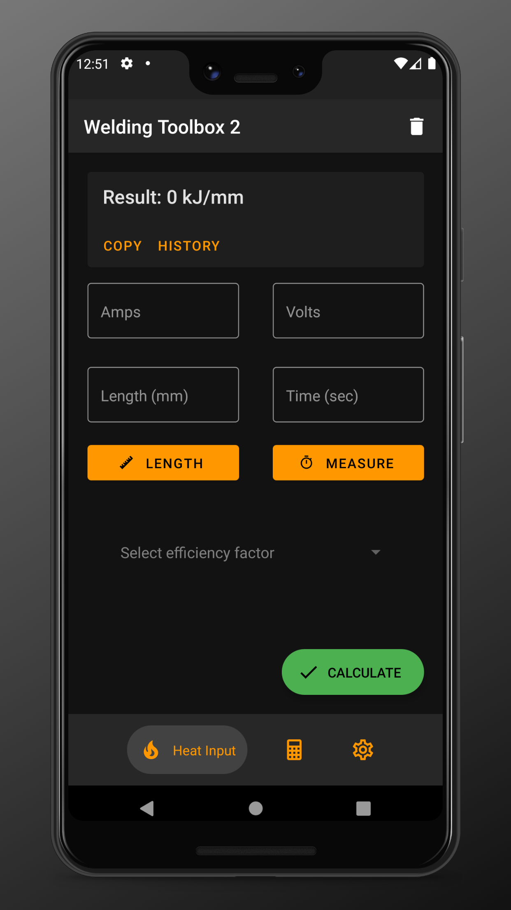
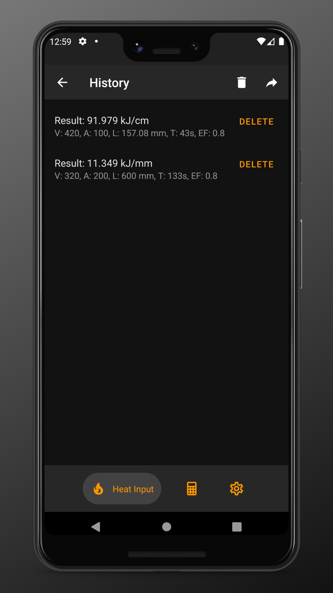
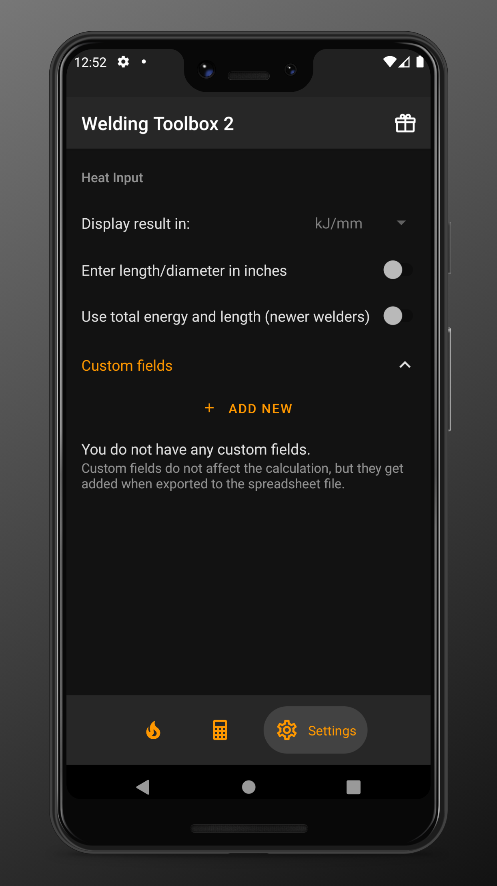

# Welding Toolbox 2 🛠️

> Application for welding inspectors, written in React Native ⚛️

  
  
  
  

## Installation

    
    

## Usage

WIP

## Related

- [Welding Toolbox](https://github.com/xxczaki/welding-toolbox/) - the original Welding Toolbox app

### License

MIT

_Google Play and the Google Play logo are trademarks of Google LLC._

_Apple and the Apple logo are trademarks of Apple Inc., registered in the U.S. and other countries._
