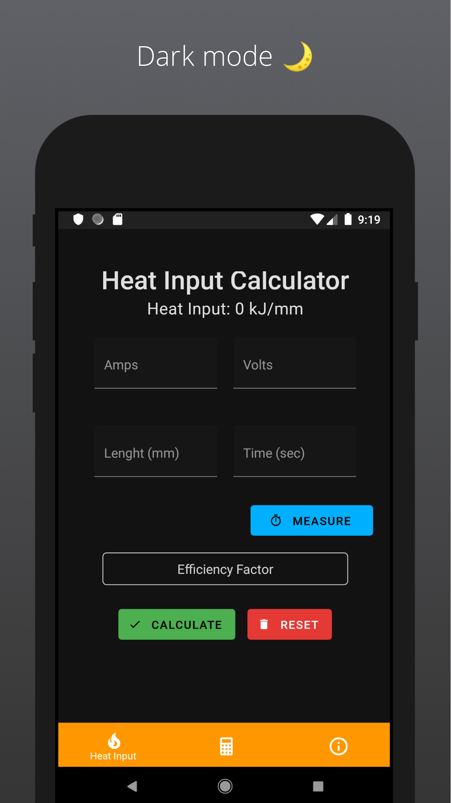
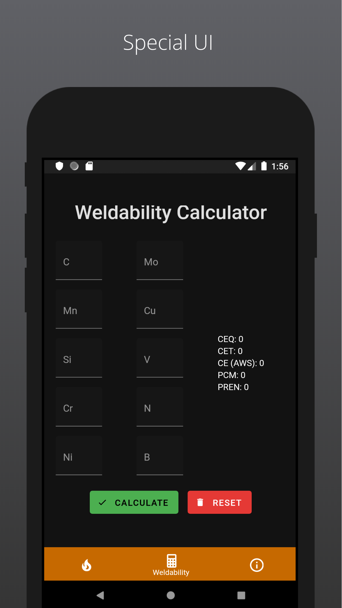
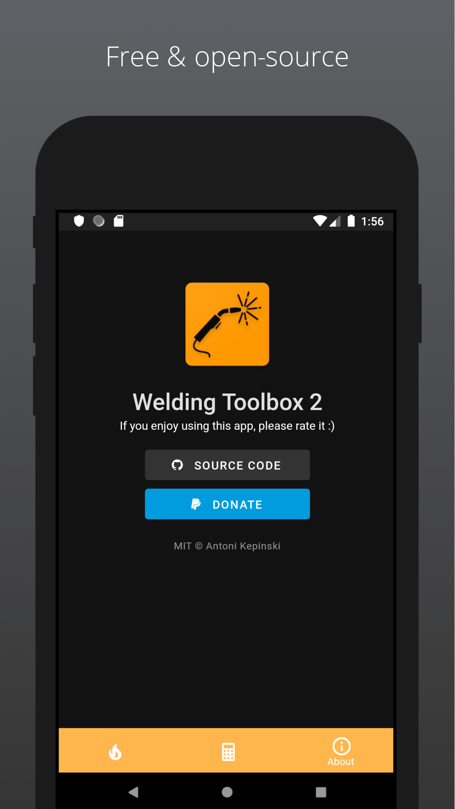

# Welding Toolbox 2 🛠️

> An app containing a set of useful welding tools, written in React Native ⚛️

<div style="display: flex; flex-direction: row; flex-wrap: wrap">
  
  
  
</div>

## Installation

Currently, only the Android version is available.

[![Google Play Download][google-play-badge]][google-play-download]

## Usage

```bash
# Install dependencies
$ npm install

# Run Metro bundler
$ npm start

# Run on Android in development
$ npm run android

# Run on IOS in development
$ npm run ios

# Lint
$ npm test
```

### License

MIT

[google-play-badge]: https://play.google.com/intl/en_us/badges/images/badge_new.png
[google-play-download]: https://play.google.com/store/apps/details?id=me.kepinski.weldingtoolbox2
