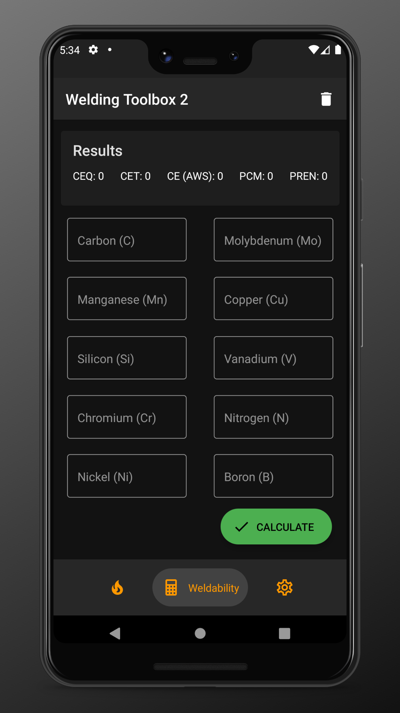

# Welding Toolbox 2 🛠️

> Application for welding inspectors, written in React Native ⚛️

<div style="display: flex; flex-direction: row; flex-wrap: wrap">
  
  
  
  
</div>

## Installation

<div style="display: flex; flex-direction: column">
    <a href='https://play.google.com/store/apps/details?id=me.kepinski.weldingtoolbox2&hl=en&gl=US&pcampaignid=pcampaignidMKT-Other-global-all-co-prtnr-py-PartBadge-Mar2515-1' style="width: 270px; height: 110px; margin-left: -18px"></a>
    <a href="https://apps.apple.com/us/app/welding-toolbox-2/id1546617906?itsct=apps_box&amp;itscg=30200"></a>
</div>

## Usage

```bash
# Install dependencies
$ npm install

# Run Metro bundler
$ npm start

# Run on Android in development
$ npm run android

# Run on IOS in development
$ npm run ios

# Lint
$ npm test
```

## Related

- [Welding Toolbox](https://github.com/xxczaki/welding-toolbox/) - the original Welding Toolbox app

### License

MIT

*Google Play and the Google Play logo are trademarks of Google LLC.*

*Apple and the Apple logo are trademarks of Apple Inc., registered in the U.S. and other countries.*
